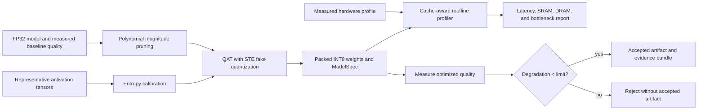

# Architecture and design constraints

Edge-Opt separates optimization behavior from deployment-backend behavior. The core algorithms use
NumPy and a small, serializable intermediate representation (IR). PyTorch is an optional adapter, and
vendor compilers consume the packed export rather than being hidden behind a misleading generic
latency number.

## Data flow

The quality measurement is deliberately external to the static transform. Accuracy cannot be
inferred from sparsity, calibration error, or model size; it must be evaluated on the task's held-out
dataset. `OptimizationPipeline` accepts those measurements and applies the gate.

## Quantization choices

- Weights default to signed symmetric INT8, with independent output-channel scales.
- Activations default to signed symmetric INT8 but support unsigned affine quantization.
- Fake quantization calculates `round(x / scale + zero_point)`, clamps to the integer range, and
  dequantizes back to the training dtype.
- The PyTorch backward pass uses `x + (fake_quantized(x) - x).detach()`, the identity STE.
- Entropy calibration is per tensor. Per-channel calibration uses the min/max observer.
- Packed PyTorch modules are reference kernels, not claims of native integer execution.

## Sparsity and storage are separate capabilities

A zero weight only reduces latency if the target has a sparse kernel, and only reduces memory if the
runtime stores a sparse representation. `HardwareProfile` therefore has distinct
`sparse_compute_supported` and `sparse_storage_supported` switches.

The default bitmap representation stores one bit per original weight plus each nonzero value. The
coordinate representation accounts for configurable index width and block size. `ideal` exists to
show the theoretical payload floor but should not be used for deployment planning unless the runtime
really provides equivalent compression.

## Roofline interpretation

Edge-Opt counts a multiply and an add as two operations. A layer's input, output, and encoded weights
form its working set. This deliberately simple static model does not yet simulate tiling, tensor
lifetime overlap, cache conflict misses, DMA/compute overlap, operator fusion, thermal throttling, or
runtime scheduling. It is appropriate for sensitivity analysis and early architecture decisions.
Final latency claims require `benchmark_callable` on the intended runtime and board.

## Supported static operators

The IR derives operation counts for linear, 2-D convolution, depthwise convolution, matrix
multiplication, activation, pooling, and elementwise operators. Other operations must provide an
explicit nonnegative `flops` attribute. This fails early instead of silently treating unknown work as
free.

## Quality-gate semantics

For higher-is-better metrics, degradation is `baseline - optimized`. For lower-is-better metrics it
is `optimized - baseline`. Improvements are negative degradation and pass. The default limit is
strict: a value equal to `0.01`, within floating-point comparison tolerance, fails. Non-finite quality
measurements are invalid.

## Extension points

- Add a hardware target by constructing a `HardwareProfile` or loading its JSON.
- Add vendor packing by translating `edge-opt-int8-v1/manifest.json` and `weights.npz`.
- Add a framework adapter that emits `ModelSpec` and consumes calibration tables.
- Add operator-specific FLOP calculation in `operator_flops` while retaining explicit validation.
- Replace the analytical latency result with board measurements in downstream reports.

